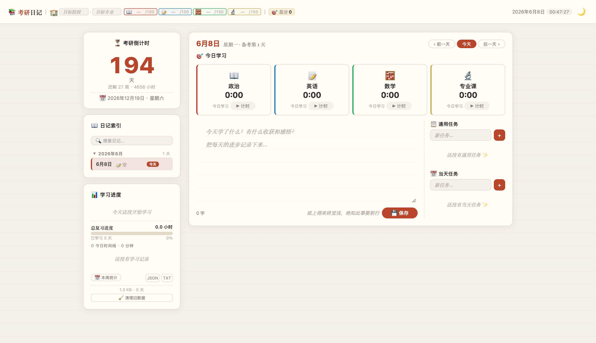

# 📚 考研日记 · 倒计时

> 专门为考研学子打造的一站式学习记录 Web 应用 —— 计时、日记、任务、统计，陪伴你走过备考每一天。



---

## 📖 项目介绍

**考研日记**是一款面向中国研究生入学考试（考研）备考学生的本地化学习管理工具。纯前端实现，无需联网，无需注册，打开即用。

### 核心功能一览

| 功能 | 说明 |
|------|------|
| ⏱ **四科计时器** | 政治/英语/数学/专业课独立计时，自动记录学习 session |
| 📝 **每日日记** | 仿纸质感编辑器，自动保存，每日一句励志名言 |
| ✅ **双栏任务** | 通用任务（累积式）+ 当天任务，完成状态按天独立 |
| 🎯 **目标设定** | 院校、专业、各科目标分，总分自动汇总 |
| 📊 **数据统计** | 今日概览、周统计表、柱状图、科目分布图 |
| 🏆 **成就系统** | 12 个成就徽章，自动检测并解锁 |
| 🌙 **深色模式** | 一键切换，偏好自动保存 |
| 📤 **数据导出** | JSON 完整备份 / TXT 可读文本 |
| 🧹 **自动维护** | 30 天旧数据自动清理，存储用量实时监控 |

### 适用场景

考研、考公、考证等任何需要长期备考的场景。所有数据存在本地，无需担心隐私泄露。

---

## 🔧 安装方式

### 方式一：双击启动（推荐，macOS）

```bash
# 确保已安装 Python 3
python3 --version

# 双击 start.command，或终端执行：
cd 考研日记/
python3 server.py
```

浏览器自动打开 [http://localhost:8080](http://localhost:8080)。

### 方式二：终端启动（跨平台）

```bash
cd 考研日记/
python3 server.py
```

手动访问 [http://localhost:8080](http://localhost:8080)。

### 方式三：无服务器模式

直接用浏览器打开 `index.html` 文件即可。数据存储在 `localStorage` 中，无需任何后端。

> **停止服务器**：终端按 `Ctrl + C`。

### 文件结构

```
考研日记/
├── index.html             ← 主页面
├── styles.css             ← 样式表
├── src/                   ← JavaScript 模块（16 文件）
│   ├── config.js          ← 常量配置
│   ├── state.js           ← 状态管理
│   ├── dom.js             ← DOM 引用
│   ├── utils.js           ← 工具函数
│   ├── storage.js         ← 存储/同步
│   ├── theme.js           ← 主题切换
│   ├── achievements.js    ← 成就系统
│   ├── clock.js           ← 时钟/倒计时
│   ├── subjects.js        ← 科目计时器
│   ├── diary.js           ← 日记编辑器
│   ├── goals.js           ← 目标设定
│   ├── todos.js           ← 任务管理
│   ├── stats.js           ← 统计/图表
│   ├── export.js          ← 数据导出
│   ├── events.js          ← 事件绑定
│   └── init.js            ← 启动编排
├── server.py              ← Python 本地服务器
├── start.command          ← macOS 启动脚本
├── data.json              ← 数据文件（自动生成）
└── README.md              ← 本文件
```

---

## 🎓 实用教程

### 1. 考研倒计时

打开应用后，右侧边栏顶部实时显示距考研初试（默认 **2026 年 12 月 19 日**）的倒计时。

- **修改考试日期**：编辑 `src/config.js` 中的 `EXAM_DATE` 常量

```js
const EXAM_DATE = '2027-12-25'; // 改为你的目标日期
```

---

### 2. 记录每日学习

#### 使用计时器

页面主区域有四个科目卡片，点击即可计时：

| 科目 | Emoji | 满分 | 操作 |
|------|-------|------|------|
| 政治 | 📖 | 100 | 点击开始 → 再点击暂停 |
| 英语 | 📝 | 100 | 点击切换到该科目 |
| 数学 | 🧮 | 150 | 自动停止上一个计时 |
| 专业课 | 🔬 | 150 | 只能记录当天学习 |

- 每次开始/暂停都会生成一条 **学习 session**，记录起止时间和时长
- 侧边栏实时显示今日各科学习分钟数
- 查看历史日期时，计时按钮自动隐藏

#### 查看学习时间线

侧边栏底部展示今日每段学习的起止时间，正在进行的 session 会实时刷新结束时间。

---

### 3. 写日记

左侧编辑区用于记录每日备考心得：

1. **撰写**：在文本框中输入日记内容（最多 10000 字）
2. **保存**：自动保存（离开输入框时），也可点击「💾 保存」按钮或按 `Ctrl + Enter`
3. **字数统计**：右下角实时显示去空格字数
4. **每日名言**：每天一句不同的励志名言（基于日期哈希索引）

#### 管理日记

- **导航**：顶栏「前一天」/「后一天」/「今天」按钮
- **索引**：侧边栏按月份分组，支持折叠/展开
- **搜索**：侧边栏搜索框按内容实时过滤
- **删除**：鼠标悬停日记条目，点击右侧 ✕ 按钮
- **快捷跳转**：点击索引中的日期直接跳转

> 删除日记时，该日期的当天任务和通用任务也会一并清理。

---

### 4. 管理任务

右侧任务面板分为两个区域：

#### 📋 通用任务（累积式）

| 特性 | 说明 |
|------|------|
| 生命周期 | 从**创建日**起出现，延续到所有后续日期 |
| 删除规则 | 只影响当前及以后的日期，**过去已定型**不受影响 |
| 完成状态 | **按天独立**：今天打勾，明天自动恢复未完成 |
| 删除日记 | 删除整篇日记时，创建于该天的通用任务自动清除 |

**使用场景示例**：
- 6 月 6 日创建「背单词」→ 6 月 6 日起每天出现
- 6 月 9 日创建「背课文」→ 6 月 9 日起与「背单词」同时出现
- 6 月 10 日删除「背单词」→ 6 月 10 日及之后不再出现，6 月 6~9 日照旧

#### 📅 当天任务

- 仅限当前日期，切换日期后自动消失
- 适合一次性备忘，如「今天去拿快递」

---

### 5. 设定目标

顶栏可设置：

1. **目标院校** — 输入学校名称
2. **目标专业** — 输入报考专业
3. **各科目标分** — 政治/英语/数学/专业课分别设定分数
4. **总分** — 自动汇总显示

---

### 6. 查看统计数据

#### 今日概览（侧边栏）

- 今日各科学习时长
- 总学习分钟数
- 复习进度条（默认目标 **500 小时**，显示百分比）
- 已学习天数
- 今日学习时间线

#### 本周统计

点击「📅 本周统计」展开：

- **科目×七天矩阵表**：每日各科学习时长明细
- **周柱状图**：每日总时长可视化（CSS 纯实现）
- **今日科目分布图**：各科学习时长占比（堆叠条形图 + 图例）

---

### 7. 成就系统

内置 12 个成就，满足条件时自动弹出通知横幅：

| 成就 | 🏅 | 条件 |
|------|-----|------|
| 坚持三天 | 🔥 | 连续学习 3 天 |
| 一周不断 | 💪 | 连续学习 7 天 |
| 自律达人 | 🏆 | 连续学习 14 天 |
| 一个月来风雨无阻 | 👑 | 连续学习 30 天 |
| 五十小时 | ⭐ | 累计学习 50 小时 |
| 破百小时 | 🌟 | 累计学习 100 小时 |
| 三百小时 | 💎 | 累计学习 300 小时 |
| 五百小时大神 | ⚡ | 累计学习 500 小时 |
| 八小时日 | 🚀 | 单日学习 8 小时以上 |
| 十小时日 | 🦾 | 单日学习 10 小时以上 |
| 日记十篇 | 📚 | 写了 10 篇日记 |
| 日记半百 | 📖 | 写了 50 篇日记 |

---

### 8. 深色模式

点击顶栏 🌙 / ☀️ 按钮切换主题，偏好自动保存到浏览器。

---

### 9. 数据导出与维护

#### 导出数据

点击侧边栏底部的按钮：

| 格式 | 用途 |
|------|------|
| **JSON** | 完整结构化备份，可恢复全部数据 |
| **TXT** | 可读文本格式，适合直接查看和打印 |

#### 清理旧数据

点击「🧹 清理旧数据」按钮，自动删除 30 天前的学习 session 明细（汇总数据不受影响），释放存储空间。

底部实时显示当前存储用量和日记天数。

---

### 10. 快捷键

| 快捷键 | 功能 |
|--------|------|
| `Ctrl + Enter` | 保存日记 |
| `←` `→` 方向键 | 日记列表中切换选中项（需焦点在索引区） |
| `Enter` / `Space` | 打开选中的日记 |
| `Enter` / `Space` | 展开/折叠月份（焦点在月份标题时） |
| `Enter` / `Space` | 开始/暂停计时（焦点在科目卡片时） |

---

## 数据存储

| 模式 | 存储位置 | 特点 |
|------|---------|------|
| 直接打开 `index.html` | `localStorage` | 离线可用，无需服务器 |
| 通过 `server.py` 打开 | `localStorage` + `data.json` | 双重保障，文件可迁移 |

### localStorage Key 说明

| Key | 内容 |
|-----|------|
| `ky_diary_state` | 应用状态（目标、任务、科目、设置） |
| `ky_diary_pages` | 日记内容 + 学习数据 + 当天任务 |
| `ky_diary_theme` | 主题偏好 |
| `ky_achievements` | 已解锁成就 |
| `ky_month_collapsed` | 月份折叠状态 |

> **迁移数据**：将整个文件夹复制到新电脑，通过 `server.py` 启动即可。建议定期导出 JSON 备份。

---

## 技术栈

| 方面 | 说明 |
|------|------|
| **架构** | 单页应用（SPA），前端驱动 |
| **UI** | 纯原生 HTML + CSS，零框架 |
| **渲染** | 脏标记 + `requestAnimationFrame` 批处理 |
| **性能** | 轻量/全量双轨渲染、增量 DOM、总量缓存 |
| **存储** | `localStorage` + 可选 `data.json` 文件同步 |
| **后端** | Python 3 HTTP 服务器（静态文件 + REST API） |
| **模块** | 16 个模块文件，按依赖链加载 |

---

## 浏览器兼容

| 浏览器 | 支持 |
|--------|------|
| Chrome 80+ | ✅ |
| Firefox 80+ | ✅ |
| Safari 14+ | ✅ |
| Edge 80+ | ✅ |
| 移动端 Chrome/Safari | ✅ 自适应 |

> 依赖：`localStorage`、`CSS Grid`、`CSS Custom Properties`、`requestAnimationFrame`。

---

## 常见问题

**Q：数据会丢失吗？**
数据同时存在 `localStorage` 和（启动服务器后）`data.json`。建议定期导出 JSON 备份。

**Q：如何添加新科目？**
编辑 `src/config.js` 中的 `DEFAULT_SUBJECTS` 数组，按格式新增即可。

**Q：存储空间不足怎么办？**
点击「🧹 清理旧数据」按钮，或导出 JSON 备份后清理浏览器 localStorage。

**Q：如何修改考研日期？**
修改 `src/config.js` 中的 `EXAM_DATE` 常量。

---

*每一个努力的今天，都会在十二月开花结果 🌸*
